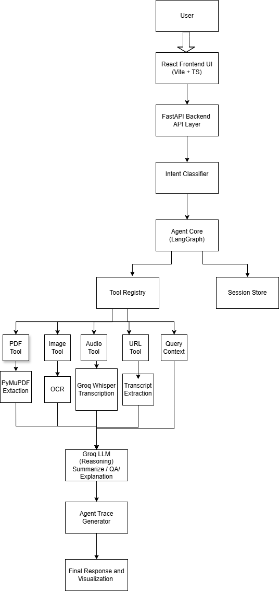

#  Datasmith AI Agent

Datasmith is a multimodal AI Agent capable of processing and analyzing multiple input formats including text, PDFs, images, audio files, and URLs. The system uses FastAPI for backend orchestration, React + TypeScript for the frontend, Groq LLMs for reasoning and summarization, and a modular agent pipeline with trace visualization.

---

## Live Deployment

### Frontend

https://full-stack-ai-agent-frontend-k56u.onrender.com/

### Backend API

https://full-stack-ai-agent-1-6rwq.onrender.com/

### API Documentation

https://full-stack-ai-agent-1-6rwq.onrender.com/docs

---

## Features

### Conversational AI Agent

* Multi-turn chat interface
* Session-based conversations
* Streaming responses
* Intent-aware processing

### PDF Analysis

* Upload PDF documents
* Extract and analyze text
* Summarization
* Question Answering

### Image Analysis

* OCR extraction
* Text understanding
* Visual content analysis

### Audio Processing

* Audio transcription using Groq Whisper
* Automatic summarization
* Multi-format support:

  * WAV
  * MP3
  * M4A
  * OGG
  * FLAC

### URL Analysis

* Extract content from web pages
* Summarize webpage content
* Question answering over extracted text

### Agent Trace Visualization

* Step-by-step execution tracking
* Processing timeline
* Tool execution details
* Performance monitoring

---

## System Architecture

Input Sources

* User Text
* PDF Documents
* Images
* Audio Files
* URLs

↓

Input Processing Layer

* PDF Parser
* OCR Engine
* Audio Transcriber
* URL Extractor

↓

Agent Core

* Intent Classification
* Context Aggregation
* Multi-Agent Planning
* Tool Selection

↓

Groq LLM Layer

* Summarization
* Question Answering
* Explanation
* Reasoning

↓

Output Layer

* Final Response
* Agent Trace
* Execution Metadata

---

## Technology Stack

### Frontend

* React 19
* TypeScript
* Vite
* Tailwind CSS
* Axios
* Lucide React

### Backend

* FastAPI
* Python 3.12
* Pydantic
* Uvicorn

### AI Stack

* Groq API
* LangGraph
* OCR
* Whisper Transcription

### Deployment

* Docker
* Render

---

## Project Structure

```text
Datasmith/
│
├── frontend/
│   ├── src/
│   ├── public/
│   └── package.json
│
├── backend/
│   ├── app/
│   │   ├── api/
│   │   ├── core/
│   │   ├── models/
│   │   ├── services/
│   │   └── main.py
│   │
│   ├── Dockerfile
│   └── requirements.txt
│
├── docker-compose.yml
└── README.md
```

---

## Local Setup

### Backend

```bash
cd backend

python -m venv venv

# Windows
venv\Scripts\activate

pip install -r requirements.txt

uvicorn app.main:app --reload
```

Backend runs at:

```text
http://localhost:8000
```

---

### Frontend

```bash
cd frontend

npm install

npm run dev
```

Frontend runs at:

```text
http://localhost:5173
```

---

## Environment Variables

### Backend

```env
GROQ_API_KEY=your_api_key
GROQ_MODEL=llama-3.3-70b-versatile
ALLOWED_ORIGINS=http://localhost:5173
```

### Frontend

```env
VITE_API_URL=http://localhost:8000
```

---

## API Endpoints

### Health

```http
GET /api/v1/health
```

### Chat

```http
POST /api/v1/chat
```

### Streaming Chat

```http
POST /api/v1/chat/stream
```

### PDF Upload

```http
POST /api/v1/pdf/upload
```

### Image Upload

```http
POST /api/v1/image/upload
```

### Audio Upload

```http
POST /api/v1/audio/upload
```

### Multi-Input Analysis

```http
POST /api/v1/analyze
```

---

## Design Decisions

### Why FastAPI?

* High performance
* Async support
* Automatic OpenAPI documentation
* Easy deployment

### Why Groq?

* Low latency inference
* High-quality reasoning models
* Fast transcription support

### Why Modular Services?

* Easy maintenance
* Separation of concerns
* Extensible architecture

### Architecture

---

## Deployment

The application is containerized using Docker and deployed on Render.

Deployment artifacts included:

* Dockerfile
* requirements.txt
* Environment variable configuration
* Live deployment URL

---

## Future Improvements

* RAG support with vector databases
* Persistent conversation storage
* User authentication
* Tool marketplace
* Multi-agent collaboration

---

## Author

Ayush Metkar

